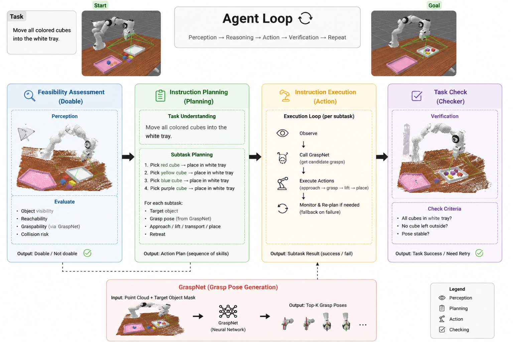

# Agentic Manipulation

An agentic robotic manipulation framework built with **ManiSkill**, **Panda Wrist RGB-D Camera**, **Qwen3-VL**, and **GraspNet**.



==Demo video is here:==

**https://www.bilibili.com/video/BV1sPuU6TEi1/ **

The system implements a closed-loop manipulation pipeline in which a vision-language model interprets natural-language instructions and visual observations, GraspNet predicts 6-DoF grasp poses from RGB-D observations, and the robotics runtime executes and verifies manipulation actions inside ManiSkill.

## Overview

The current system uses:

- **ManiSkill / SAPIEN** for robotic simulation
- **Franka Panda with wrist-mounted RGB-D camera**
- **Qwen3-VL** through Ollama for:
  - task feasibility checking
  - scene understanding
  - task planning
  - target grounding
  - post-action verification
- **GraspNet** for 6-DoF grasp pose generation
- **Point-cloud geometry** for target association and grasp filtering
- **Closed-loop execution** with retry and visual verification

The primary workflow is:

```text
Natural-language command
        ↓
Wrist RGB-D observation
        ↓
Qwen3-VL
  ├─ feasibility
  ├─ planning
  └─ visual grounding
        ↓
Target RGB-D / point cloud
        ↓
GraspNet
        ↓
6-DoF grasp candidates
        ↓
Geometric filtering
        ↓
Panda end-effector motion
        ↓
Grasp / transport / release
        ↓
Visual + simulation verification
        ↓
Success or retry
```

## Example Task

For example:

```text
Put the blue cube into the white bin.
```

The agent:

1. observes the scene from the Panda wrist camera,
2. identifies the target object and destination,
3. constructs the target point cloud,
4. queries GraspNet for grasp candidates,
5. transforms the selected grasp pose into the robot/world coordinate system,
6. moves the end effector to the pre-grasp pose,
7. approaches and closes the gripper,
8. transports the object to the target bin,
9. releases the object,
10. verifies task completion.

---

# Hardware Used for Development

The current system has been developed and tested on:

| Component | Configuration |
|---|---|
| System RAM | **64 GB** |
| GPU | **NVIDIA GeForce RTX 4070 Laptop GPU** |
| GPU VRAM | **8 GB** |
| Platform | Windows |
| Shell | PowerShell |

The 8 GB GPU is sufficient for the current development setup when GPU memory usage is managed carefully.

In particular, the recommended configuration is:

- use **CUDA for GraspNet / PyTorch**,
- use the stable **CPU rendering backend for ManiSkill/SAPIEN** when necessary,
- let **Ollama manage Qwen3-VL independently**.

Running the VLM, GraspNet, and GPU simulation rendering simultaneously may exceed 8 GB of VRAM.

---

# Software Environment

The development environment currently uses approximately:

```text
Python      3.12
ManiSkill   3.x
SAPIEN      3.x
PyTorch     CUDA-enabled
NumPy
Open3D
Ollama
Qwen3-VL
GraspNet
```

Example tested package versions include:

```text
Python     3.12.13
ManiSkill  3.0.1
SAPIEN     3.0.3
PyTorch    2.11.0 + CUDA 12.8
NumPy      2.4.4
```

Exact versions may vary depending on the local CUDA and GraspNet build environment.

---

# External Dependency: GraspNet Baseline

**GraspNet is not included in this repository.**

Before running real grasp inference, deploy the official GraspNet baseline separately:

[graspnet/graspnet-baseline](https://github.com/graspnet/graspnet-baseline)

The expected project layout is:

```text
agentic_manipulation/
├── README.md
├── scripts/
├── src/
│
└── graspnet-baseline/       # external dependency, not included
    ├── models/
    ├── dataset/
    ├── utils/
    ├── pointnet2/
    ├── knn/
    └── ...
```

Clone it into the project root:

```powershell
git clone https://github.com/graspnet/graspnet-baseline.git
```

Then:

```powershell
cd graspnet-baseline
pip install -r requirements.txt
```

## Build GraspNet PointNet2 Extension

```powershell
cd pointnet2
python setup.py install
cd ..
```

## Build GraspNet KNN Extension

```powershell
cd knn
python setup.py install
cd ..
```

You may also need the official GraspNet API:

```powershell
git clone https://github.com/graspnet/graspnetAPI.git
cd graspnetAPI
pip install .
```

Refer to the official repository for platform-specific installation details:

https://github.com/graspnet/graspnet-baseline

---

# GraspNet Checkpoint

A pretrained GraspNet checkpoint is required for real grasp inference.

For the current pipeline, the RealSense checkpoint can be used:

```text
checkpoint-rs.tar
```

Place it for example at:

```text
agentic_manipulation/
└── graspnet-baseline/
    └── checkpoint-rs.tar
```

The checkpoint is not distributed with this repository.

Please download pretrained weights according to the instructions in the official GraspNet repository.

---

# Python Path

The current integration directly imports GraspNet modules from its source tree.

From the project root, configure:

```powershell
$env:PYTHONPATH="$PWD\graspnet-baseline\models;$PWD\graspnet-baseline\dataset;$PWD\graspnet-baseline\utils;$PWD\src"
```

---

# Ollama and Qwen3-VL

Install Ollama separately and prepare Qwen3-VL.

Pull the model:

```powershell
ollama pull qwen3-vl:2b
```

Start Ollama:

```powershell
$env:OLLAMA_HOST="http://127.0.0.1:11434"
$env:OLLAMA_CONTEXT_LENGTH=16384

ollama serve
```

In another terminal, optionally verify the model:

```powershell
$env:OLLAMA_HOST="http://127.0.0.1:11434"
$env:OLLAMA_CONTEXT_LENGTH=16384

ollama run qwen3-vl:2b
```

---

# Run the Panda Wrist-Camera Simulation

Start the persistent ManiSkill scene:

```powershell
python scripts/ee_camera_demo.py `
    --robot panda_wristcam `
    --render-mode human `
    --render-backend cpu `
    --show-frustum
```

The simulation owns:

- the ManiSkill environment,
- the Panda robot,
- the wrist RGB-D camera,
- the SAPIEN visualization window,
- robot state,
- object state,
- command execution.

The agent should connect to this existing simulation rather than creating a second environment.

---

# Start the Agent

In another PowerShell terminal:

```powershell
$env:OLLAMA_HOST="http://127.0.0.1:11434"
$env:OLLAMA_CONTEXT_LENGTH=16384

$env:PYTHONPATH="$PWD\graspnet-baseline\models;$PWD\graspnet-baseline\dataset;$PWD\graspnet-baseline\utils;$PWD\src"

python scripts/panda_agent_demo.py --connect --mode real
```

You can then enter natural-language commands interactively.

Example:

```text
> Put the blue cube into the white bin.
```

Chinese commands are also supported:

```text
> 请把蓝色方块放到白色盒子中
```

A single command can also be sent directly:

```powershell
python scripts/panda_agent_demo.py `
    --connect `
    --mode real `
    --command "Put the blue cube into the white bin."
```

---

# Real Grasp Inference

A more explicit real-mode invocation is:

```powershell
python scripts/panda_agent_demo.py `
    --mode real `
    --command "Put the blue cube into the white bin." `
    --seed 0 `
    --max-retries 2 `
    --output-root temp/agent_real `
    --render-backend cpu `
    --record `
    --checkpoint graspnet-baseline/checkpoint-rs.tar `
    --device cuda
```

The current configuration uses the CPU renderer for simulation while allowing GraspNet to run with CUDA.

This configuration is particularly useful on GPUs with limited VRAM such as the tested **RTX 4070 Laptop GPU with 8 GB VRAM**.

---

# Grasp Pose Transformation

GraspNet predicts a grasp pose in the camera coordinate system.

The grasp is transformed into an end-effector target using the transformation chain:

```text
world_from_ee
    =
world_from_camera
    @ camera_from_grasp
    @ grasp_from_ee
```

This allows grasp poses inferred from the wrist RGB-D observation to be converted into robot control targets in the simulation/world coordinate system.

---

# Grasp Candidate Filtering

Raw GraspNet predictions are not executed directly.

Candidate grasps are filtered using several geometric constraints, including:

- target-object association,
- gripper opening constraints,
- collision checking,
- approach-angle constraints,
- grasp score,
- grasp-center distance.

The current Panda setup additionally prioritizes approximately vertical grasp candidates where appropriate.

If no safe candidate satisfies the constraints, the system aborts or retries instead of blindly executing the highest-scoring grasp.

---

# Closed-Loop Agent

The agent does not execute an entire task open-loop.

Each manipulation step follows approximately:

```text
Observe
   ↓
Understand
   ↓
Plan
   ↓
Ground target
   ↓
Generate grasp
   ↓
Execute
   ↓
Observe again
   ↓
Verify
   ↓
Success / Retry
```

A failed attempt triggers a new observation and a new grasp computation rather than simply replaying the previous action.

---

# Debug Visualization

The real pipeline can visualize intermediate perception and grasp results.

Current debugging outputs include:

- RGB target / destination bounding boxes,
- grayscale depth visualization,
- projected GraspNet candidates,
- target-object point cloud,
- local workspace point cloud,
- grasp candidate centers,
- selected 3D gripper geometry,
- 6-DoF coordinate axes.

Debug results can also be saved under:

```text
temp/panda_agent/<run-id>/
```

---

# Main Components

The public code is organized approximately as:

```text
scripts/
├── ee_camera_demo.py
├── panda_agent_demo.py
├── grasp_component.py
├── vlm_component.py
└── ...

src/
└── agentic_manipulation/
    ├── runtime/
    ├── models/
    ├── control/
    ├── envs/
    └── ...
```

Important modules include:

```text
runtime/agent.py
    Closed-loop agent state machine

models/qwen_vl.py
    Ollama / Qwen3-VL interface

models/graspnet.py
    GraspNet adapter and grasp filtering

control/executor.py
    Robot grasp / transport / release execution

envs/
    ManiSkill manipulation environments
```

---

# Notes

This repository contains the agentic manipulation integration code only.

Large third-party repositories, model checkpoints, temporary outputs, and local development files should not be committed into this repository.

In particular:

```text
graspnet-baseline/
checkpoints/
temp/
outputs/
```

should normally remain external or ignored by Git.

---

# Acknowledgements

This project builds on several open-source robotics and machine-learning projects:

- [ManiSkill](https://github.com/haosulab/ManiSkill)
- [SAPIEN](https://sapien.ucsd.edu/)
- [GraspNet Baseline](https://github.com/graspnet/graspnet-baseline)
- [GraspNet API](https://github.com/graspnet/graspnetAPI)
- [Ollama](https://ollama.com/)
- Qwen3-VL

GraspNet Baseline is the official baseline implementation for **GraspNet-1Billion: A Large-Scale Benchmark for General Object Grasping**.

Please follow the licenses and citation requirements of the corresponding upstream projects.

---

# Status

This project is under active development.

The current focus is a lightweight closed-loop agentic manipulation stack combining:

```text
Vision-Language Reasoning
        +
RGB-D Geometry
        +
6-DoF Grasp Prediction
        +
Robot Control
        +
Closed-Loop Verification
```

with an emphasis on running the full pipeline on consumer hardware.